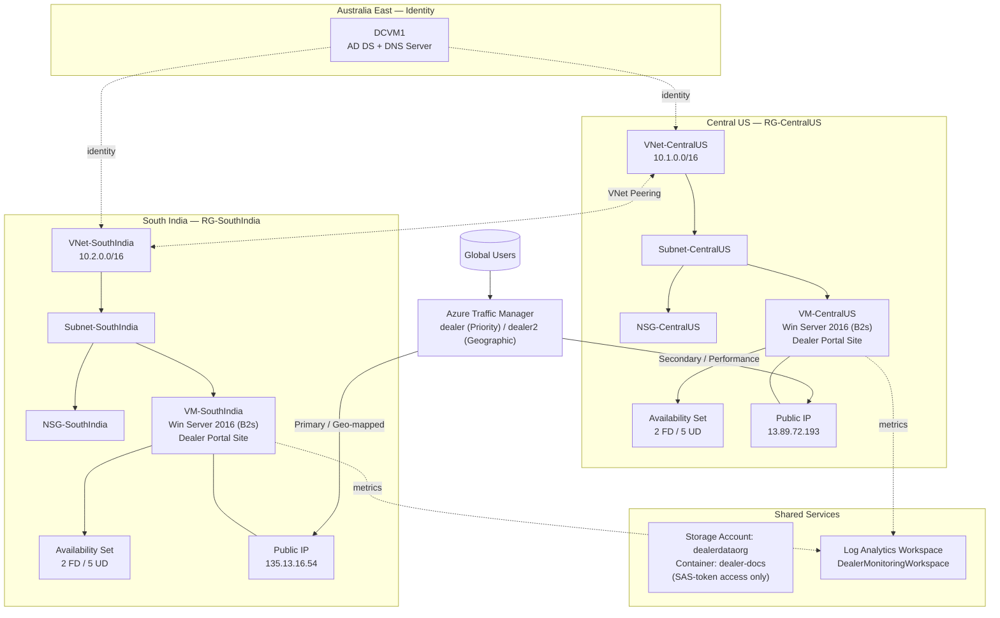

# Azure Multi-Region High Availability & Disaster Recovery Architecture

[](#)
[](#)
[](#)

A personal cloud engineering project that designs and deploys a **multi-region, internet-facing web application** on Azure with built-in high availability, disaster recovery via automated DNS failover, identity migration from on-premises AD, and centralized monitoring.

> **Project type:** Independent / self-directed Azure infrastructure project (AZ-104 applied learning project)
> **Scenario:** A manufacturing company ("Bluetim") is migrating its on-premises infrastructure and a customer-facing "Dealer Portal" web application to Azure, with a requirement for high availability across two geographic regions.

---

## 1. Overview

| | |
|---|---|
| **Goal** | Migrate on-prem identity + a customer-facing web app to Azure with multi-region HA/DR |
| **Regions** | Central US (primary compute) & South India (secondary compute), Australia East (identity) |
| **Key outcomes** | Cross-region failover validated live via DNS + ICMP testing, secure document distribution via SAS tokens, full metric-based alerting across both regions |

### Key Outcomes
- Deployed a **dual-region web tier** (Central US + South India) serving an identical customer-facing site, peered at the network level.
- Configured **Azure Traffic Manager** with two routing strategies (Priority for DR failover, Geographic for latency-based routing) and **validated a live regional failover** event end-to-end.
- Migrated on-prem **Active Directory (users, groups, DNS)** to an Azure-hosted Domain Controller.
- Secured document distribution using **Blob Storage with public access disabled** and **time-limited SAS tokens**.
- Built **Azure Monitor + Log Analytics** alerting across compute, disk, network, and VM availability metrics for both regions.

---

## 2. Architecture Diagram

> Full diagrams (architecture + failover sequence) are in [`architecture/architecture-diagram.md`](architecture/architecture-diagram.md)



---

## 3. Technologies Used

- **Compute:** Azure Virtual Machines (Windows Server 2016 Datacenter, Standard B2s), Availability Sets
- **Networking:** Azure Virtual Network (VNet), Subnets, Network Security Groups (NSG), VNet Peering, Public IPs
- **Traffic Management:** Azure Traffic Manager (Priority routing & Geographic routing profiles)
- **Identity:** Active Directory Domain Services (AD DS), DNS Server (on a domain controller VM)
- **Storage:** Azure Blob Storage, Shared Access Signature (SAS) tokens
- **Monitoring:** Azure Monitor, Log Analytics Workspace, Metric & Activity Log Alert Rules
- **Tooling:** Azure Portal, Windows `nslookup` / `ping` for DNS & connectivity validation, RDP

---

## 4. Infrastructure Components

| Component | Detail |
|---|---|
| **Resource Groups** | `RG-CentralUS`, `RG-SouthIndia`, plus a dedicated RG for the AD/DNS domain controller |
| **VNets** | `VNet-CentralUS` (10.1.0.0/16), `VNet-SouthIndia` (10.2.0.0/16), `AD1DC1-vnet` (10.0.0.0/16, Australia East) |
| **NSGs** | `NSG-CentralUS`, `NSG-SouthIndia` — region-scoped network security groups on each subnet |
| **VMs** | `VM-CentralUS` (Central US, 13.89.72.193), `VM-SouthIndia` (South India, 135.13.16.54) — both Windows Server 2016, Standard B2s, hosting the same static "Dealer Portal" site |
| **Availability Sets** | `AVSET-CentralUS`, `AVSET-SouthIndia` — 2 fault domains / 5 update domains each |
| **Domain Controller** | `DCVM1` — runs Active Directory Domain Services + DNS Manager, migrated users/groups from on-prem AD |
| **Storage Account** | `dealerdataorg` → container `dealer-docs` — hosts dealer handbook documents |
| **Traffic Manager Profiles** | `dealer` (Priority routing — South India = Priority 1 / primary, Central US = Priority 2 / secondary) and `dealer2` (Geographic routing — Asia/Australia traffic geo-mapped to the South India endpoint) |
| **VNet Peering** | `VNet-CentralUS` ↔ `VNet-SouthIndia` (bidirectional peering, both sides "Connected") |
| **Monitoring** | `DealerMonitoringWorkspace` (Log Analytics) + alert rules for CPU %, available memory, OS/data disk IOPS, network in/out totals, and VM availability for both VMs |

---

## 5. Deployment Steps

1. **Identity foundation** — Deployed `DCVM1` (Windows Server) via an ARM template, promoted to a Domain Controller, configured AD DS (users, security groups) and DNS to mirror the on-prem directory structure.
2. **Networking** — Created `VNet-CentralUS` and `VNet-SouthIndia` with dedicated subnets and NSGs, mirroring the on-prem network segmentation. Configured **VNet Peering** between the two regional VNets for cross-region connectivity.
3. **Compute** — Provisioned `VM-CentralUS` and `VM-SouthIndia` (Windows Server 2016, Standard B2s) inside their respective subnets, each assigned a Public IP and placed into a region-specific **Availability Set** (2 fault domains / 5 update domains).
4. **Application** — Deployed a static HTML "Dealer Portal" site (Bluetim) onto IIS on both VMs so each region serves an identical copy of the app.
5. **Storage** — Created storage account `dealerdataorg` with container `dealer-docs`, disabled public blob access, uploaded `Dealer_Handbook.pdf`, and generated a **read-only, HTTPS-only, time-bound SAS token** for controlled distribution to dealers.
6. **Traffic Management** —
   - Created Traffic Manager profile **`dealer`** with **Priority routing**: South India endpoint = Priority 1 (primary), Central US endpoint = Priority 2 (failover).
   - Created a second profile **`dealer2`** with **Geographic routing**, mapping Asia (India, China) and Australia/Pacific traffic to the South India endpoint.
   - Enabled health checks (HTTP probes) on both endpoints.
7. **Monitoring** — Deployed `DealerMonitoringWorkspace` (Log Analytics) and created metric alert rules for CPU %, memory, disk IOPS, network throughput, and VM availability (`VMDown_CUS`, `VMDown_STI`) across both VMs.
8. **Validation** — Used `ping` and `nslookup` from a client to confirm Traffic Manager DNS resolution, regional routing, and automatic failover behaviour (see [Troubleshooting](docs/troubleshooting.md)).

---

## 6. Security Considerations

- **No public blob access** — the `dealer-docs` container has anonymous access explicitly disabled. A direct browser request to the blob URL returns `PublicAccessNotPermitted`.
- **SAS tokens over account keys** — document distribution to external dealers uses **Shared Access Signatures** scoped to read-only, HTTPS-only, with a defined start/expiry window — instead of handing out storage account keys.
- **Network segmentation** — each region has its own VNet/subnet/NSG, limiting blast radius and controlling inbound traffic per region.
- **Identity migration** — centralizing AD in Azure (rather than leaving multiple on-prem DCs) gives a single point for access control and auditing going forward.
- **Availability Sets** — spreading VM instances across fault/update domains reduces the chance that a single hardware failure or host-level maintenance event takes down the whole regional tier.

---

## 7. Monitoring & Logging

- **Log Analytics Workspace:** `DealerMonitoringWorkspace` — central workspace for activity logs and diagnostics across both resource groups.
- **Alert rules configured (per VM, both regions):**
  - `Percentage CPU > 50/80`
  - `Available Memory Bytes <` threshold
  - `Data Disk IOPS Consumed` / `OS Disk IOPS Consumed`
  - `Network In Total > 500000` / `Network Out Total > 20000`
  - `VMAvailabilityMetric < 1` (→ `VMDown_CUS`, `VMDown_STI`)
  - Activity log alert on `VM Deallocation` events
- **Live validation:** the `VMDown_CUS` alert fired (Severity 3 – Informational) during testing and is visible in the Monitor → Alerts blade, confirming the alert pipeline end-to-end (rule → fire → Log Analytics activity log entry).

See screenshot: [`screenshots/14-monitoring-alerts-log-analytics.jpg`](screenshots/14-monitoring-alerts-log-analytics.jpg)

---

## 8. Troubleshooting

Full root-cause narratives (constraints hit, debugging steps, commands run, and resolutions) are documented in:

➡️ **[`docs/troubleshooting.md`](docs/troubleshooting.md)**

Highlights:
- **Live DR failover test** — South India endpoint was taken offline; Traffic Manager marked it `Degraded` and rerouted `dealer.trafficmanager.net` to the Central US VM. Verified via `ping` (request timed out / 100% loss) and `nslookup` (DNS resolved to the new region).
- **Free-tier compute quota constraint** — couldn't scale Availability Sets to multiple VMs per region or stand up an internal Load Balancer due to subscription CPU quota limits. Pivoted the HA/DR design to **Traffic Manager-based DNS failover** between two single-VM regions instead — and documented this as a deliberate design trade-off.
- **Blob public access lockout** — confirmed storage hardening by reproducing the `PublicAccessNotPermitted` error on a direct blob URL, then issuing a SAS token and validating successful, scoped access.

---

## 9. Lessons Learned

See [`docs/lessons-learned-and-future-improvements.md`](docs/lessons-learned-and-future-improvements.md) for the full write-up. Key takeaways:

- DNS-based failover (Traffic Manager) is a viable, low-cost DR pattern when regional Load Balancers/VMSS aren't feasible (e.g. subscription limits) — but it trades off failover speed (DNS TTL/caching) versus an L4/L7 load balancer.
- Designing for **two routing methods on the same backend** (Priority for DR, Geographic for performance) clarified the difference between *availability-driven* and *latency-driven* traffic engineering.
- Validating infrastructure behaviour with basic tools (`ping`, `nslookup`) — rather than just trusting the portal's green ticks — was essential to *prove* the failover actually worked.

---

## 10. Future Improvements

- Rebuild this entire environment as **Infrastructure as Code (Terraform)** for repeatability and version-controlled change management — *tracked as a separate follow-up project.*
- Replace the static HTML site with a small App Service / containerized workload, and front each region with **Azure Application Gateway** or **Azure Front Door** for L7 routing, WAF, and faster failover than DNS TTL allows.
- Scale Availability Sets → **Virtual Machine Scale Sets (VMSS)** across Availability Zones once subscription limits allow.
- Add **Azure Backup / Azure Site Recovery** for VM-level disaster recovery in addition to the application-level DNS failover.
- Migrate Blob Storage access from SAS tokens to **Azure AD-based access (RBAC + Managed Identity)** for stronger auditability.
- Build Grafana/Workbook dashboards on top of the Log Analytics workspace for a single-pane-of-glass view across both regions.

---

## Repository Structure

```text
azure-multiregion-ha-dr-architecture/
├── README.md
├── architecture/
│   └── architecture-diagram.md      # Network + failover sequence diagrams (Mermaid)
├── docs/
│   ├── troubleshooting.md           # Detailed RCA / debugging narratives
│   └── lessons-learned-and-future-improvements.md
├── resume/
│   ├── resume-bullets.md
│   ├── linkedin-project-description.md
│   └── interview-talking-points.md
└── screenshots/                     # 14 annotated screenshots from the build
```

---

## About This Project

This is an **independent cloud engineering project**. All resources were provisioned and tested in a personal Azure subscription. No production data or employer infrastructure was used.
