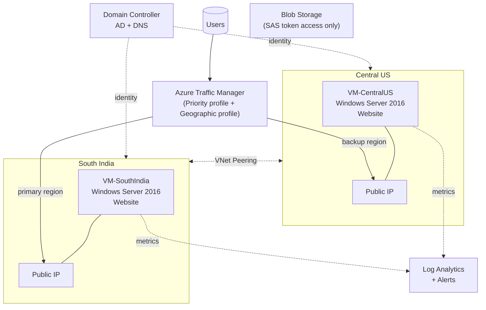

# Azure Multi-Region High Availability & DR Setup

This is a personal project I built while studying for the AZ-104 (Azure Administrator) exam. The scenario: a company is migrating from on-premises to Azure, and needs its customer-facing website to stay available even if an entire Azure region goes down.

I deployed the same website to two Azure regions (Central US and South India), connected them, put Azure Traffic Manager in front of both so traffic automatically reroutes if one region fails, migrated user identity to an Azure-hosted domain controller, locked down document storage, and set up monitoring across both regions. I also tested the failover myself instead of just trusting that it was configured correctly.

<<<<<<< HEAD
This was built manually through the Azure Portal, not with Terraform — that's a separate project I'm planning next.
=======
> **Project type:** Independent / self-directed Azure infrastructure project
> **Scenario:** A manufacturing company ("Bluetim") is migrating its on-premises infrastructure and a customer-facing "Dealer Portal" web application to Azure, with a requirement for high availability across two geographic regions.
>>>>>>> 2f83772fa93c9cff821dfd946d8c57c5422471c6

---

## What I built

- Two Azure regions (Central US, South India), each with its own VNet, subnet, NSG, and a Windows Server VM running the same website.
- The two VNets are peered so resources in each region can talk to each other.
- Azure Traffic Manager in front of both regions, set up two ways:
  - **Priority routing** — South India is the main region, Central US takes over automatically if South India goes down.
  - **Geographic routing** — a second profile that sends users in Asia/Australia to South India and everyone else to Central US.
- A domain controller VM running Active Directory and DNS, standing in for the on-prem AD that would normally be migrated.
- Blob Storage for sharing documents with dealers, with public access turned off and SAS tokens used for access instead.
- Azure Monitor + a Log Analytics workspace, with alerts on CPU, memory, disk, network, and whether each VM is up.

---

## Architecture



A more detailed version of this diagram, plus a step-by-step of what happened during the failover test, is in [`architecture/architecture-diagram.md`](architecture/architecture-diagram.md).

---

## Tools and services used

Azure Virtual Network, Subnets, Network Security Groups, VNet Peering, Azure VMs, Availability Sets, Azure Traffic Manager, Active Directory Domain Services, DNS, Azure Blob Storage, Shared Access Signatures (SAS), Azure Monitor, Log Analytics. Tested connectivity and DNS resolution using `ping` and `nslookup`.

---

## How it's put together

**Identity** — I deployed a Windows VM and promoted it to a domain controller, then set up Active Directory and DNS on it to represent the migrated on-prem identity.

**Networking** — Created a VNet and subnet in each region with its own NSG, then peered the two VNets so they could reach each other.

**Compute** — One VM per region, each with a public IP and sitting in an Availability Set (I wanted multiple VMs per region for proper load balancing, but my subscription's free-tier CPU quota wouldn't allow it — more on that below).

**Website** — A simple HTML site, deployed identically to both VMs so either region can serve it.

**Storage** — Created a storage account and container for dealer documents, turned off public access, and used SAS tokens to share files securely instead.

**Traffic Manager** — Set up two profiles on the same two endpoints: one using Priority routing for failover, one using Geographic routing so nearby users get sent to the closer region.

**Monitoring** — Set up a Log Analytics workspace and alert rules for CPU, memory, disk, network, and VM availability on both VMs.

---

## Security notes

- Blob storage has public access turned off completely — I confirmed this by trying to open a blob URL directly in a browser and getting an access-denied error. Documents are only accessible through a SAS token, which is read-only, HTTPS-only, and expires after a set time.
- Each region has its own NSG, so traffic is filtered per-region rather than relying on one shared rule set.
- Centralizing identity in one Azure-hosted domain controller (instead of multiple on-prem DCs) makes user/group management easier to audit.

---

## Monitoring

Alert rules are set up per VM, per region, covering:
- CPU usage
- Available memory
- Disk IOPS
- Network in/out
- Whether the VM is up at all (`VMDown_CUS`, `VMDown_STI`)

I didn't just leave these configured and assume they worked — I actually triggered one (by stopping a VM) and confirmed it showed up in the Alerts page with the right severity. See the screenshot: [`screenshots/14-monitoring-alerts-log-analytics.jpg`](screenshots/14-monitoring-alerts-log-analytics.jpg).

---

## Problems I ran into

Full write-up with commands and screenshots is in [`docs/troubleshooting.md`](docs/troubleshooting.md). Short version:

1. **Testing the failover** — I shut down the South India endpoint and watched Traffic Manager mark it as degraded, then confirmed with `nslookup` that the DNS name now pointed to the Central US VM. Also ran `ping` against the South India IP and got 100% packet loss, which is what you'd expect.

2. **Hit a subscription limit** — I originally wanted multiple VMs per region behind an internal load balancer, but my free-tier subscription's CPU quota wouldn't let me create a second VM in the same Availability Set. I switched the design to rely on Traffic Manager for failover between regions instead, since that didn't need more compute. Worth knowing this is a quota issue, not a design choice I'd make on a real subscription.

3. **Blob storage access** — Wanted to make sure documents weren't publicly readable. Tried opening the blob URL directly and got a `PublicAccessNotPermitted` error, which confirmed the setting was working. Then generated a SAS token and confirmed that link worked instead.

4. **Checking alerts actually fire** — Created the alert rules, then deliberately stopped a VM to make sure the availability alert actually triggered rather than just sitting there unused.

---

## What I'd do differently / next time

- Rebuild this whole thing in Terraform instead of clicking through the Portal — that's planned as a separate project.
- Look into Azure Front Door or Application Gateway instead of Traffic Manager, since DNS-based failover isn't instant (it depends on DNS caching/TTL) — a proper load balancer would fail over faster.
- Use Azure AD-based access instead of SAS tokens for the storage account, since SAS tokens are still a shared secret.
- If I had more quota, scale out to multiple VMs per region (or move to VM Scale Sets) for real load balancing within a region, not just failover between regions.
- Add Azure Backup or Site Recovery for VM-level recovery, on top of the DNS failover I already have.

More detail on this in [`docs/lessons-learned-and-future-improvements.md`](docs/lessons-learned-and-future-improvements.md).

---

## Repo structure

```text
azure-multiregion-ha-dr-architecture/
├── README.md
├── architecture/
│   └── architecture-diagram.md
├── docs/
│   ├── troubleshooting.md
│   └── lessons-learned-and-future-improvements.md
└── screenshots/
```

<<<<<<< HEAD
This was built and tested in my own personal Azure subscription — no employer infrastructure or production data involved.
=======
---

## About This Project

This is an **independent cloud engineering project**. All resources were provisioned and tested in a personal Azure subscription. No production data or employer infrastructure was used.
>>>>>>> 2f83772fa93c9cff821dfd946d8c57c5422471c6
