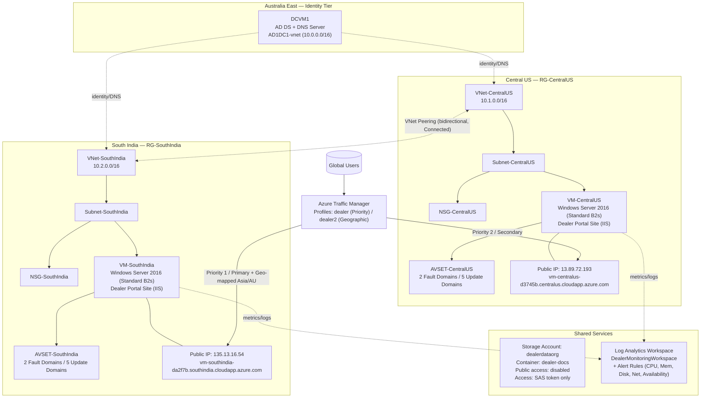
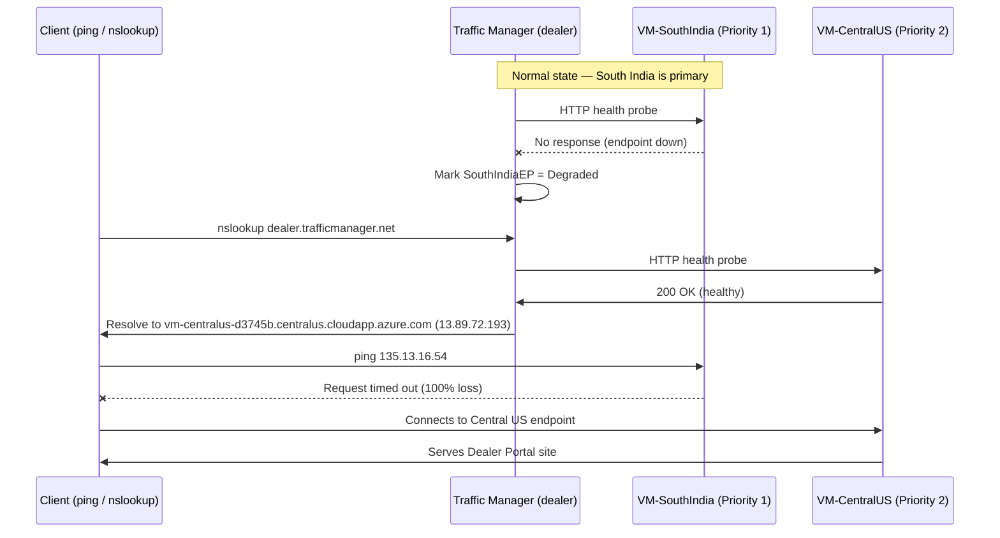

# Architecture Diagrams

A closer look at how everything connects, and what the failover test actually looked like step by step.

## 1. Network & Infrastructure Topology

---

## 2. What happened during the failover test

This is the sequence from the failover test described in [`../docs/troubleshooting.md`](../docs/troubleshooting.md) — South India was taken offline on purpose to see how Traffic Manager would react.

