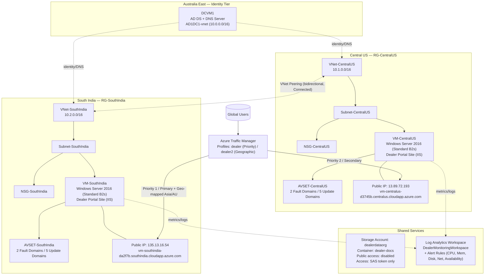
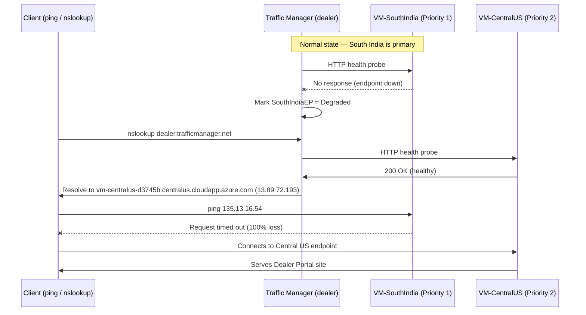

# Architecture Diagrams

## 1. Network & Infrastructure Topology



---

## 2. Disaster Recovery Failover Sequence (Validated)

This sequence reflects the failover behaviour observed and validated during testing —
see [`../docs/troubleshooting.md`](../docs/troubleshooting.md) for the full narrative.



---

## 3. Traffic Manager Routing Methods Comparison

```mermaid
graph LR
    subgraph Profile1["Profile: dealer (Priority Routing)"]
        A["Incoming request"] --> B{Is Priority 1<br/>(South India) healthy?}
        B -->|Yes| C[Route to South India]
        B -->|No| D[Failover to Central US<br/>Priority 2]
    end

    subgraph Profile2["Profile: dealer2 (Geographic Routing)"]
        E["Incoming request"] --> F{User region?}
        F -->|Asia: India, China<br/>Australia/Pacific: NSW| G[Route to South India - STI1]
        F -->|Other regions| H[Route to Central US - CUS1]
    end
```
